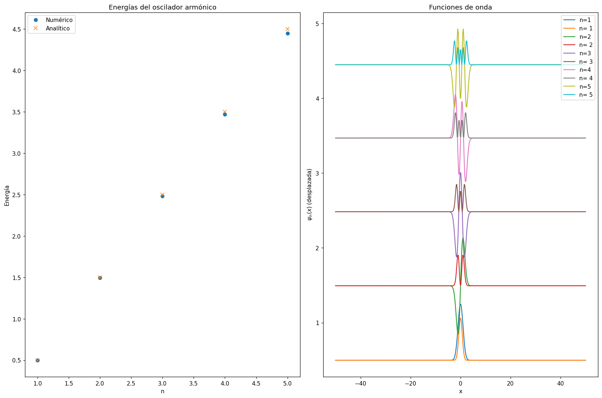

# 1D Quantum Harmonic Oscillator — Finite Difference Method

Numerical solution of the time-independent Schrödinger equation for the one-dimensional harmonic potential. The results are compared with the exact spectrum `Eₙ = ħω(n + ½)`.



## Method

1. **Grid.** Discretise `x ∈ [−L, L]` on N equally spaced points. The wavefunction is implicitly zero outside the grid.
2. **Kinetic operator.** Build the second-derivative matrix with central finite differences (−2 on the diagonal, 1 on the off-diagonals) and scale it by `−ħ²/(2m·Δx²)`.
3. **Potential.** Add the harmonic potential `V(x) = ½ m ω² x²` as a diagonal matrix, giving `H = T + V`.
4. **Diagonalisation.** Diagonalise H with `numpy.linalg.eigh`. The eigenvectors are normalised by `1/√Δx`, so that `Σ|ψ|² Δx = 1`.
5. **Validation and plots.** Compare the lowest five energies with the analytical values, and plot ψₙ(x) and |ψₙ(x)|², each shifted by its energy.

## Results

Natural units (m = ħ = ω = 1), L = 50, N = 500 (Δx ≈ 0.2):

| Level (code label) | Quantum number | Numerical | Exact | Relative error |
|---|---|---|---|---|
| 1 | 0 | 0.4987 | 0.5 | 0.25 % |
| 2 | 1 | 1.4937 | 1.5 | 0.42 % |
| 3 | 2 | 2.4836 | 2.5 | 0.66 % |
| 4 | 3 | 3.4683 | 3.5 | 0.90 % |
| 5 | 4 | 4.4479 | 4.5 | 1.16 % |

The numerical spectrum reproduces the equally spaced levels of the oscillator. The error grows with n because higher states oscillate faster and are resolved by fewer grid points.

## Limitations and possible extensions

- The low-lying states are negligible beyond |x| ≈ 6, so the box [−50, 50] spends most grid points where ψ ≈ 0. A smaller L with the same N would reduce the error.
- The central-difference scheme is second-order accurate; a convergence study (error vs Δx) would confirm the O(Δx²) behaviour.
- H is tridiagonal, so a specialised solver (`scipy.linalg.eigh_tridiagonal`) would allow much finer grids.

## Run it

```bash
pip install -r requirements.txt
python "Quantum Harmonic Oscilator.py"
```

## Tech

Python · NumPy · Matplotlib
